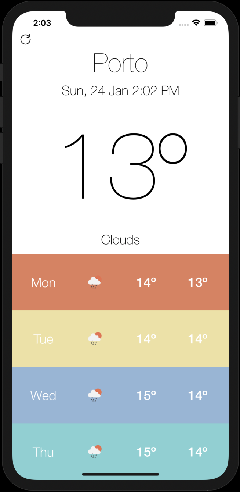

# WeatherApp

A simple test weather app that consumes the [OpenWeather API](https://openweathermap.org/api)

## Architecture

I used the Clean Architecture[[1]](https://8thlight.com/blog/uncle-bob/2012/08/13/the-clean-architecture.html)[[2]](https://herbertograca.com/2017/11/16/explicit-architecture-01-ddd-hexagonal-onion-clean-cqrs-how-i-put-it-all-together/) as a foundation for the solution, taking advantage of the Dependency Rule to create clear, loosely coupled relationships between objects.

## Libraries

I decided not to use any external dependencies, and therefore I'm not using any package manager such as CocoaPods or Carthage.

## UX/UI

I used [this design](https://dribbble.com/kolage/projects/48364--Kelvin-The-Weather-App) as an inspiration for the UI. Especially the font style & colors.

The result was this:

## Linter

I used [SwiftLint](https://github.com/realm/SwiftLint) to enforce style and conventions.